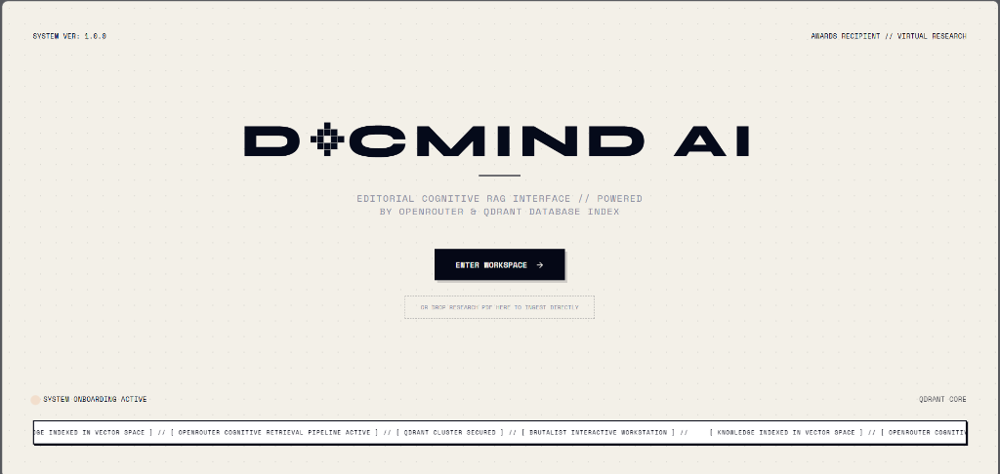
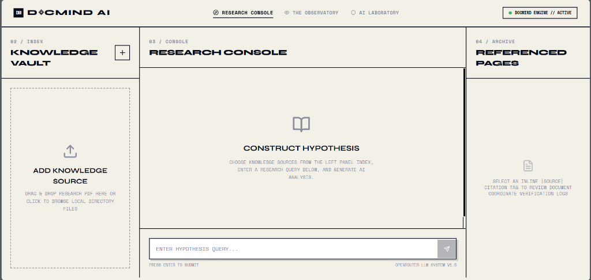

# DocMind AI: Enterprise Multi-Document RAG System

DocMind AI is a production-ready, enterprise-grade Retrieval-Augmented Generation (RAG) platform designed to ingest, index, and query complex PDF documents. The system provides real-time multi-document analysis, precise inline source citations, customizable retrieval parameters, and detailed usage analytics.

This repository represents the **complete backend service**—architected with FastAPI, LangChain, and Qdrant—along with a responsive React dashboard.

## 🖥️ Screenshots

### Landing Page


### Research Workspace


---

## 🏗️ Architecture Flow

The following diagram illustrates the ingestion pipeline and the conversational RAG search flow handled by the backend:

```mermaid
graph TD
    %% Ingestion Pipeline
    subgraph Ingestion Pipeline (Asynchronous Background Thread)
        A[PDF Upload] --> B[PyPDFLoader Page Parsing]
        B --> C[RecursiveCharacterTextSplitter]
        C --> D[OpenRouter / OpenAI text-embedding-3-small]
        D --> E[Qdrant Collection Vector Database]
    end

    %% Query Pipeline
    subgraph Query Execution (FastAPI Endpoint)
        F[User Query] --> G[Embed Query]
        G --> H[Cosine Similarity Search with Payload Filters]
        H --> I[Qdrant Matches & Context Retrieval]
        I --> J[OpenRouter LLM Interface - Gemini 2.5/3.5]
        J --> K[Inline Source Citations & Confidence Estimation]
        K --> L[FastAPI Response + Observatory Analytics Logging]
    end
```

---

## 🛠️ Core Backend Features (Resume Focus)

As the sole backend contributor, I architected, implemented, and optimized the core RAG engine and API service layer:

*   **FastAPI Asynchronous Gateway (`main.py`):** Implemented a high-performance REST API with modular endpoints, robust CORS configurations, structural Pydantic schemas, and native FastAPI `BackgroundTasks` for non-blocking operations.
*   **Dynamic Qdrant Vector Integration (`rag_engine.py`):** Designed the dynamic collection initialization and auto-alignment layer. If the vector dimensions of the current embedding model mismatch the existing collection (e.g. switching models), the service automatically performs safe migration.
*   **Highly Reliable Background Ingest Worker:** Developed a chunk-by-chunk indexing worker featuring an **Exponential Backoff Retry Strategy** to resolve transient network issues and rate limits.
*   **Custom Quota & Rate Limit Diagnostics:** Created dedicated telemetry and diagnostics for Google Gemini API rate limits (`429 Resource Exhausted`), tracking processed vs. remaining chunks and throwing specialized exceptions (`QuotaExceededError`) to prevent data loss.
*   **Granular LLM Citation Pipeline:** Configured prompt-engineered schemas to force LLMs to output verified facts tied directly to vector metadata. Structured output includes confidence scoring calculated from cosine similarity match weights.
*   **Observatory Telemetry Engine:** Designed a lightweight server-side analytics processor tracking API usage, daily queries, response latencies, and estimated token usage.

---

## 📁 Repository Structure

```directory
├── backend/
│   ├── main.py            # FastAPI Application Gateway & REST endpoints
│   ├── rag_engine.py      # Core RAG implementation, Qdrant client, and ingestion
│   ├── requirements.txt   # Python package dependencies
│   ├── .env               # Server configurations (ignored in Git)
│   ├── data/              # Persistent JSON registries (registry, config, observatory)
│   └── uploads/           # Temporarily staged PDF source files (ignored in Git)
├── frontend/              # React & Vite application dashboard
└── README.md              # Main project documentation
```

---

## ⚙️ Tech Stack

*   **Language:** Python 3.10+
*   **Web Framework:** FastAPI, Uvicorn
*   **AI/RAG Framework:** LangChain, LangChain-Community, LangChain-OpenAI
*   **Vector Database:** Qdrant (via `qdrant-client` and `langchain-qdrant`)
*   **Embedding Model:** `openai/text-embedding-3-small` (via OpenRouter)
*   **LLM Inference:** Google Gemini Models (`gemini-2.5-pro`, `gemini-2.5-flash`, `gemini-3.5-flash`) via OpenRouter
*   **Parsing & Validation:** PyPDF (v4.2.0), Pydantic (v2.7.4)
*   **Environment:** Python-dotenv

---

## 🔌 API Endpoints Documentation

### System & Configuration
*   `GET /api/health` — Verifies the server, Qdrant client connection, and OpenRouter API key status.
*   `GET /api/settings` — Retrieves the current RAG parameters (chunk size, overlap, temperature, retrieval count, active model).
*   `PUT /api/settings` — Updates the server-side RAG hyperparameters dynamically.

### Document Management
*   `GET /api/documents` — Returns list of all uploaded and processed PDFs with metadata (upload timestamp, processing status, page count).
*   `POST /api/upload` — Accepts multipart PDF upload, registers the document, and spawns the background ingestion task.
*   `DELETE /api/documents/{document_id}` — Deletes the physical PDF file, deletes metadata registry, and purges all vector points from Qdrant associated with the `document_id`.

### Query & Telemetry
*   `POST /api/query` — Submits a user query with custom document filters and conversation history. Returns LLM-generated findings, structured inline source citations, confidence estimation, and performance latencies.
*   `GET /api/analytics` — Fetches aggregate metrics for the Observatory dashboard (total PDFs, questions asked, tokens processed, daily query charts).

---

## 🚀 Getting Started

### Backend Setup

1.  **Clone the Repository:**
    ```bash
    git clone https://github.com/Mithlesh-95/AI-Powered-PDF-Question-Answering-System.git
    cd AI-Powered-PDF-Question-Answering-System/backend
    ```

2.  **Create and Activate a Virtual Environment:**
    ```bash
    python -m venv venv
    # Windows
    venv\Scripts\activate
    # macOS/Linux
    source venv/bin/activate
    ```

3.  **Install Dependencies:**
    ```bash
    pip install -r requirements.txt
    ```

4.  **Configure Environment Variables:**
    Create a `.env` file in the `backend/` directory:
    ```env
    OPENROUTER_API_KEY=your-openrouter-api-key-here
    QDRANT_URL=http://localhost:6333
    ```

5.  **Run Qdrant (Docker Recommended):**
    ```bash
    docker run -p 6333:6333 -p 6033:6033 -v qdrant_storage:/qdrant/storage qdrant/qdrant
    ```
    *Alternatively, you can configure Qdrant Cloud or run Qdrant as a local service.*

6.  **Start the FastAPI Server:**
    ```bash
    uvicorn main:app --reload --host 127.0.0.1 --port 8000
    ```
    The Swagger documentation will be available at `http://127.0.0.1:8000/docs`.

### Frontend Setup

1.  **Navigate to the frontend folder:**
    ```bash
    cd ../frontend
    ```

2.  **Install Node dependencies:**
    ```bash
    npm install
    ```

3.  **Start Development Server:**
    ```bash
    npm run dev
    ```

---

## 🏆 Key Contributions

*   **Designed & Developed End-to-End RAG Logic:** Implemented loading, chunking, embedding, vector database uploads, similarity retrieval, and custom contextual prompts.
*   **Optimized Vector Storage Management:** Configured Qdrant collection mappings and search filters, ensuring sub-second retrieval times.
*   **Engineered Resilient API Integration:** Created a background ingestion queue with exponential retry loops, robust error trapping, and Gemini rate-limit fallback protocols.
*   **Observability Dashboard Data Layer:** Built the telemetry parser that records tokens, latencies, and daily frequencies to populate the Observatory charts.
